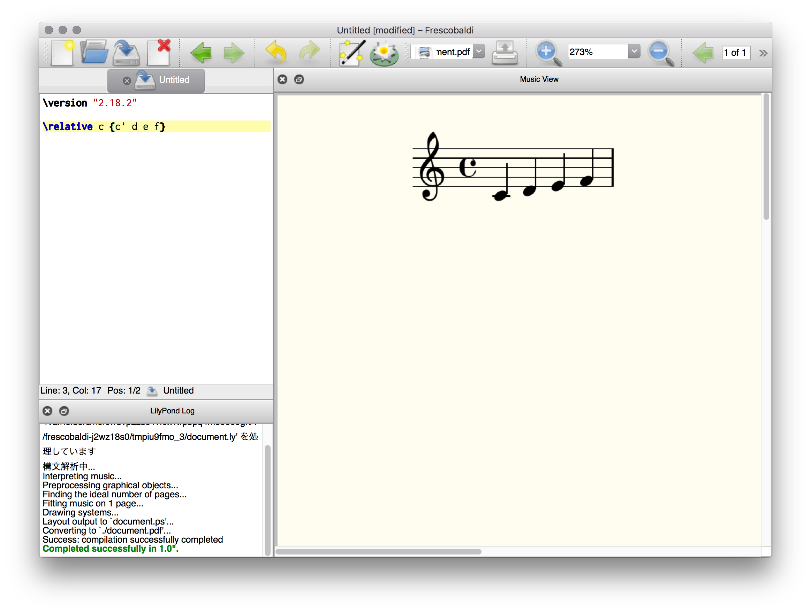

.. _week-1-day-1:

======
第一日
======

.. num-section::

.. _lilypond-official-page:

LilyPondの公式ページ
--------------------

日本語の公式ページは以下にある。

`LilyPond - みんなの楽譜作成 <http://lilypond.org/index.ja.html>`_ 

.. num-section::

.. _downloading-and-installing-lilypond:

LilyPondのダウンロード・インストール
------------------------------------

公式ページでは、「**安定版**」としてバージョン 2.18.2 を、「**開発版**」としてバージョン 2.19.xx を配布している。このドキュメントではバージョン 2.19.59 以降を対象にしているため、「**開発版**」をインストールされたい。

#. `開発版の配布ページ <http://lilypond.org/development.ja.html>`_ から、実行中の OS に合ったファイルをダウンロードする
#. `安定版の配布ページ <http://lilypond.org/download.ja.html>`_ で、 OS ごとのインストールの手順を参照し、それを行う

.. num-section::

.. _launching-lilypond:

LilyPondの実行・楽譜のコンパイル
---------------------------------

Windowsと、Unix系での実行方法をそれぞれ記す。Windows では、エクスプローラから実行する方法、コマンドラインから実行する方法がある。

Windows（エクスプローラから）
^^^^^^^^^^^^^^^^^^^^^^^^^^^^^^

1. テキストエディタで、以下の内容のファイルを "test.ly" としてデスクトップに保存する。

.. code-block:: lilypond

    \version "2.19.59"
    \relative { c' d e f g a b c }

2. デスクトップ上の "test.ly" を右クリックし、「**Generate PDF**」を選択する。

3. エラーがなければ、デスクトップに "test.pdf" が生成される。エラーがある場合、その詳細は "test.log" に記録される。

Windows 版では、同時にエディタ(LilyPad)がインストールされるが、メモ帳と同等の機能しかなく、使う必要がない。

Windows（コマンドラインから）
^^^^^^^^^^^^^^^^^^^^^^^^^^^^^^

1. テキストエディタで、以下の内容のファイルを "test.ly" として保存する

.. code-block:: lilypond

    \version "2.19.59"
    \relative { c' d e f g a b c }

2. スタートボタンを右クリックし、PowerShell を開く
3. 以下のコマンドで "test.ly" をコンパイルする

.. code-block:: bat

    chcp 437         # コンソール文字化けを防ぐ
    cd path¥to¥file  # (必要ならば) test.ly のあるディレクトリに行く
    lilypond test

Unix 系 (Linux / FreeBSD / macOS)
^^^^^^^^^^^^^^^^^^^^^^^^^^^^^^^^^^^^^^

1. テキストエディタで以下の内容の "test.ly" を作成する。

.. code-block:: lilypond

    \version "2.19.59"
    \relative { c' d e f g a b c }

2. "test.ly" をコンパイルする。

.. code-block:: bash

    $ cd /path/to/file  # (必要ならば) test.ly のあるディレクトリに行く
    $ lilypond test

エラーがなければ、同じフォルダに "test.pdf" ができる。

.. num-section::

.. _frescobaldi:

Frescobaldi
-----------

`Frescobaldi <http://frescobaldi.org/>`_ は、LilyPond に特化された機能を持つエディタである。

代表的な機能に次のようなものがある。

- ソース→楽譜、楽譜→ソース 対応点へのジャンプ
- コマンドの補完
- MIDI 再生
- ソースの移調

